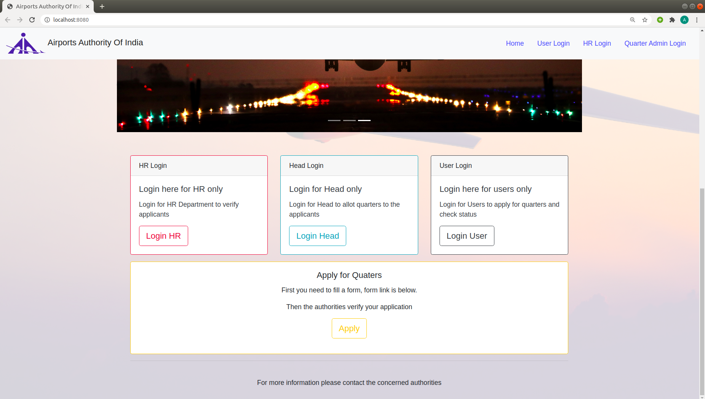
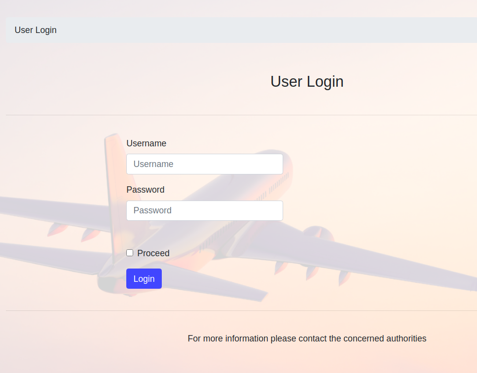
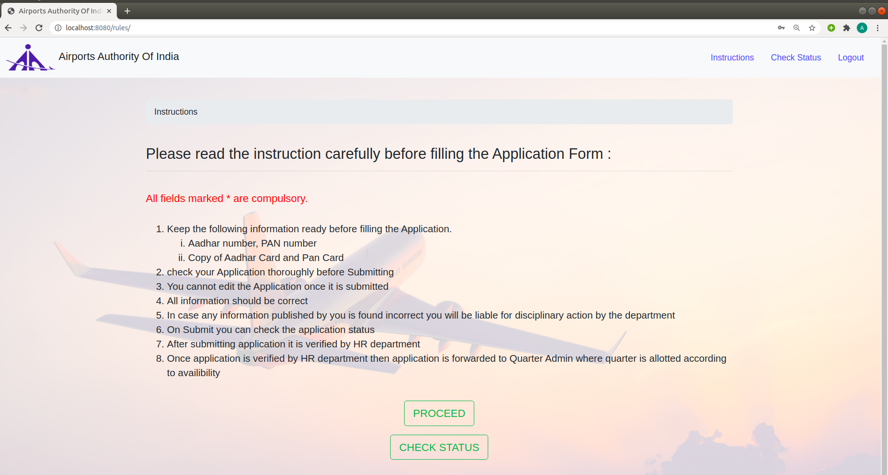
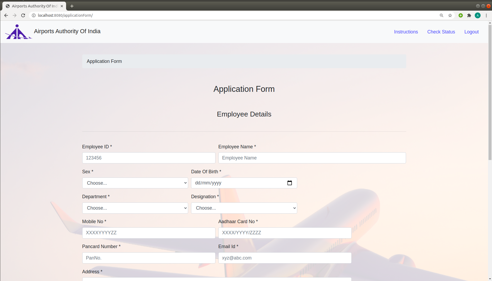
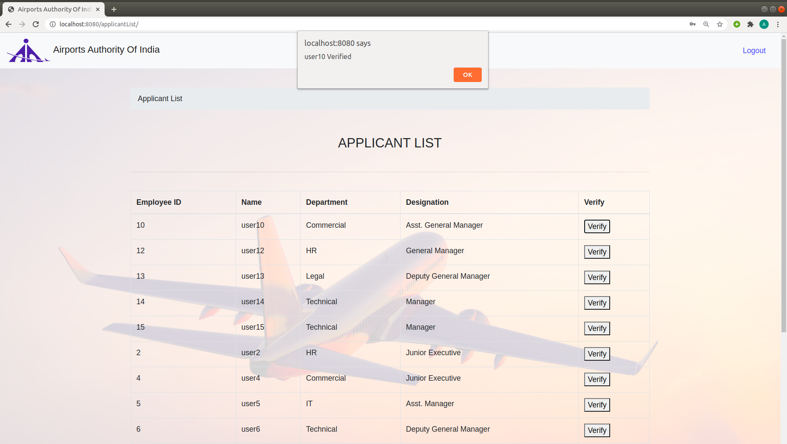
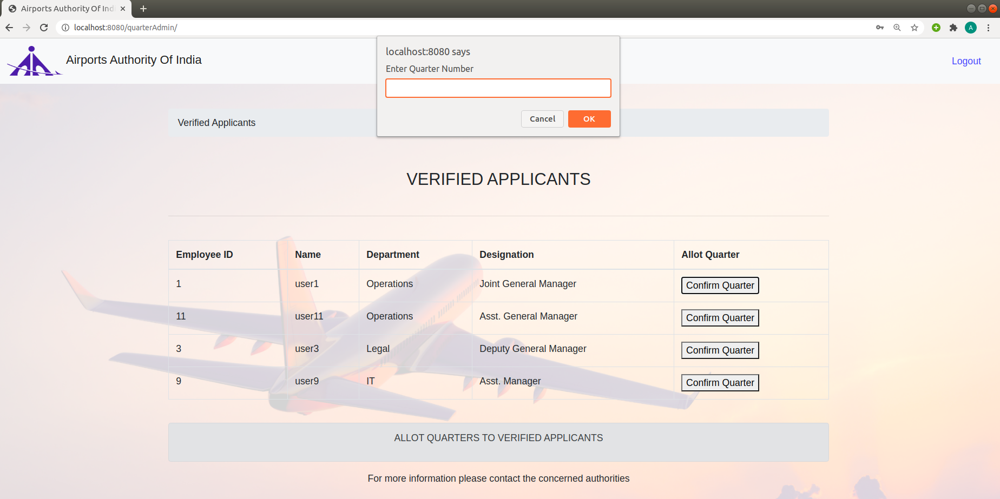

#  Quarter Allotment Web Application

   ### A web application used to digitize process of quarter allotment

    
    Website for quarter Allotment is an application that will digitalize the current system 
    for allotment of quarters to its employees. Existing Employee can login themselves on the 
    application. After login he/she can fill application form by accepting terms and conditions. 
    Application form verified by Management in two steps.
    Firstly, by HR department and then by quarter admin where he/she is allotted with a quarter.
    After verification employee get status with the allotted quarter number. Employee can check 
    application status regularly and get correct information.
    This is the solution that can save the time required in original process and provides every step
    under one roof.

### Application home page 
 

 
  

     This is the home page of application from where we can navigate to login for each user,
       
     quarter admin and HR department

  

### User Side
 

 
  

     Login page for users requires username and password which is provided by the department 
      
     for the employees and after logging in they can fill in the application form for quarter allotment.

 

  

 
     After logging in the application, the application shows the instructions page and asks weather the
      
     employee has to apply for quarter or has to check the status.

 

  

 
     When the user proceeds to fill application form, the application form is loaded which requires the 
      
     employees to fill details like name, employee id, designation, department etc.
      
     After submitting the form successfully user status is shown to the user which includes details of user 
      
     like name, employee id, department and status.

 

  

### HR Side
 

 
  

     From the home page, HR department can login to the application for further procedure. 
     After successfully logging in to the application, a list is shown to the HR department  
     listing all the applicants who have applied for the quarters. 
     After checking HR department can verify the user by clicking on the button “Verify” that is  
     in front of every applicant so as their application is forwarded to Quarter Admin for further  
     procedure and they are verified by HR department.

 

  

### HR Side
 

 
  

     From home page quarter admin can login in to the application 
     On successful login they are shown a page of all the applicants who have been verified by the 
      HR department and are eligible for further procedure. 
     With each applicant there is a button “Confirm Quarter”. After checking the availability of 
      quarter, the quarter admin can click on the button and allot quarter to that particular applicant. 
     Quarter admin is asked to enter the quarter number as per the availability. On entering the  
     number, the applicant is confirmed with the entered quarter number. 

 

 

###     Technologies used: Node.js., HTML, CSS, JavaScript, jQuery, MySQL

